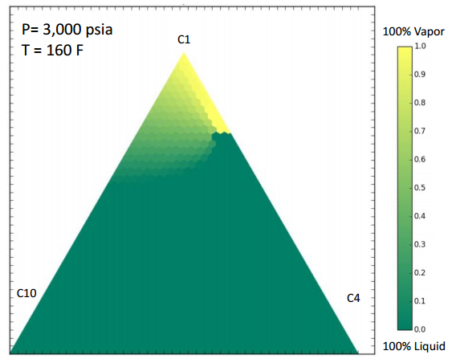
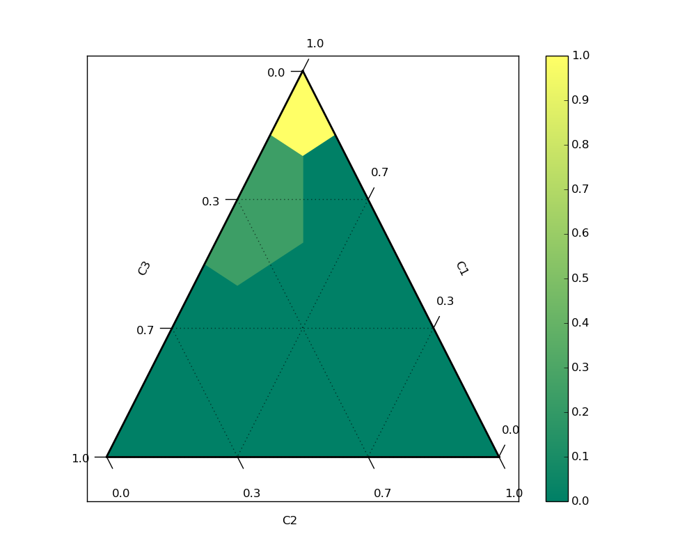
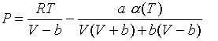
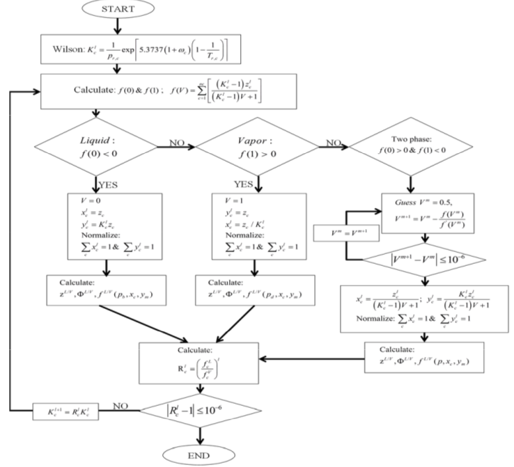

# Compositional Model

## About

This program is able to determine the composition of a multi-component hydrocarbon fluid at a given pressure and temperature. It also produces an example ternary plot of possible mixtures and the ability to view tie-lines as well as hint to the critical point. 



## Example Code

### Ternary Plot

An example code to produce a ternary plot from hydrocarbon components can be found below. Most features have been set to False in order to improve runtime


```python
from TernaryModel import create_ternary

psi = 3000 #Pressure in PSI
rankine = 160+460 #Temperature in Rankine
molecules = ['C1', 'C4', 'C10'] #Components
#specific_zFracs = [ 0.1055, 0.6301, 0.2644] # i and j are switched
amount = 10 #Number of test points in ternary plot
show_heat = True #Colorizes the plot based on fluid/liquid state.
show_tie = False #Create tie-lines
attempt_curve = False #Create boundary line around two-phase region
ternary_plot = create_ternary(molecules, psi, rankine, amt=amount, heatmap=show_heat, tie_lines=show_tie,
                              specific_zFracs=[], finish_curve=attempt_curve)
```

    ('using number of points:', 10)
    ('scale set to:', 3)
    ('max phases:', [0.64, 0.21, 0.15])




### Flashing a composition 

The main part of this project is the ability to take a composition at a temperature and pressure and be able to determine the phase. The following code gives an example of how to flash a composition without the need for the ternary plot.


```python
from Flash import flash_mixture
from Mixture import Mixture

#Inputs
molecules = ['C1', 'C4', 'C10']
z1, z2, z3 = 0.33, 0.33, 0.34
pressure = 1500
temperature = 500
#Setup and Flash
specific_mix = Mixture(molecules, [z1, z2, z3])
flash_mixture(specific_mix, pressure, temperature)
print (specific_mix.vapor, 1- specific_mix.vapor)
```

From the output (0, 1) it can be concluded that the mixture is currently 100% liquid.

## Concept

Originally this was produced in conjunction with my compositional modeling course. Ultimately the program could be used with a reservoir simulator to be able to model complex hydrocarbon flow through porous media. For a more detailed summary of the mathematics and science behind the program please contact me.

### Methodology

The composition is flashed using the Rachford and Rice flash algorithm using the Peng-Robinson as the equation of state provider.

#### Peng Robinson Equation of State

A modified Peng Robinson to account for multiple fluids was used. Below is the general form of the equation.



#### Rachford and Rice Flash Algorithm

The following algorithm contains the basic steps to walk through flashing a mixture to a given temperature and pressure.




## Installation

The program requires Python 2.7 in order to run. Simply follow the examples above to import and use the functions.

There are actually two versions of the program. A simple version that only does flash calculations. An updated version was made with the ternary plot. Below are the required libraries for the updated version. The simple version only requires NumPy. Please find the simple version in the /Compositional directory, and the updated version in the /NumCompositional directory.

### Used Libraries

NumPy - http://www.numpy.org/

Pandas - http://pandas.pydata.org/

Matplotlib - http://matplotlib.org/

python-ternary - https://github.com/marcharper/python-ternary

## Contributors

I would first like to thank my wonderful professors and teaching assistants. 

If you would like to add to this project feel free to contact me for any information.
